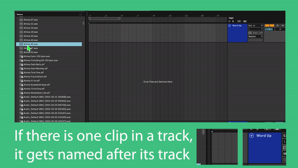
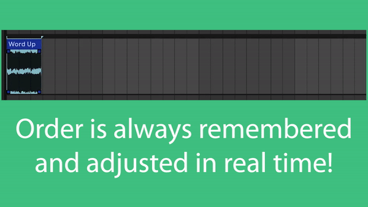
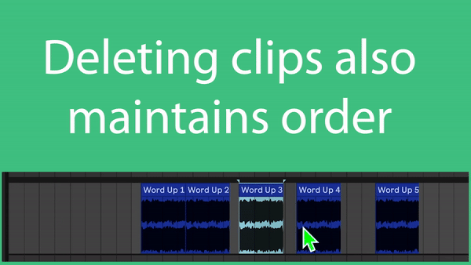
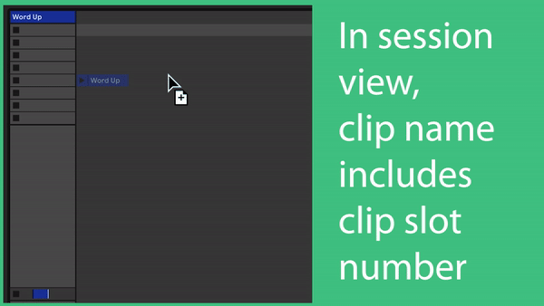
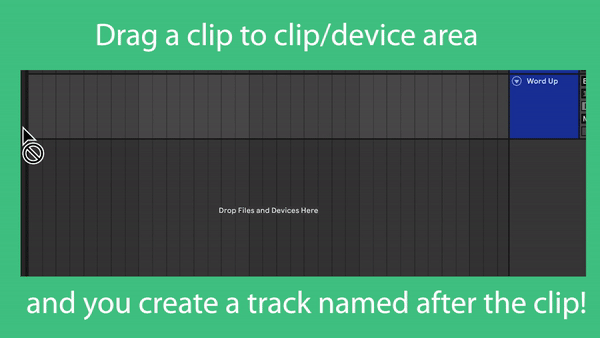

# AutoClip

  

  

  

  

  

  

By: Cory Boris  
© 2024 MIT License
## A Control Surface for Automatically Changing Clips' Names Based on the Name of their Parent Track In Ableton Live 11+ WITHOUT PLUGINS ;)

\*\*for Mac or Windows\*\*

### 6 Steps to setup:  
**Note: this assumes you are using the default user library folder. If you have moved this folder externally or otherwise, make a Remote Scripts folder inside of whatever user library folder you have pointed Ableton to, and start from step 2:**
1. Mac users:  
   Go to `/Users/your_username/Music/Ableton/User Library`  
   Windows users:  
   Go to `\Users\your_username\Documents\Ableton\User Library`
2. Create a folder 'Remote Scripts' if it's not already created.
3. Create a folder titled 'AutoClip' inside the 'Remote Scripts' folder.
4. Download **both** .py files, "AutoClip.py" and "\_\_init\_\_.py", and place them in the 'Remote Scripts/AutoClip' folder.
5. Restart or open Ableton Live
6. In Ableton, select 'AutoClip' in the "Link|Tempo|Midi" tab, and make sure the input and output are set to 'None'.

**Note**: You can add the 2 mentioned files from here to their respective folders as shown by my tutorial while Ableton is open or quit, but if Ableton is open, then you *will* have to restart Ableton for the selected control surface to go into effect. The reason being is that Ableton compiles python and loads python code into memory when Ableton starts, but not after it loads up. For you using the software, this means that in order to update this script if and when it is updated, then you will have to restart Ableton to use the updated software.

## Lit af features:
1. In Arrangement View: Rename a Midi track named 'Midi' or an Audio track named 'Audio' and then the names of every clip are **magically** changed to the name of their individual tracks + the number the clip is in order from left to right. Order is always maintained.  
2. In Session View: Rename a Midi or Audio Track and then the clips you drag to these tracks or the clips already existing will be renamed the name of the track + the number of the clip from top to bottom.  
3. The number in a renamed clip's name in Session view is not based on the next adjacent clip but rather the next adjacent clip slot whether or not there is a clip. I thought this made more sense for session view.  
4. Anytime you drop a clip in a track, it will automatically be renamed to match the above rules.  
5. Take Lanes are unaffected by this script.
6. If there is one clip in a track in arrangement view, it won't have a number, it keeps its original name.
7. If you have your default Audio and Midi tracks named 'Audio' and 'Midi', then upon dropping one or more clips into the clip/device area or into a default track, the default track's name now becomes the same as the clip's name without the last number separated by a space. So Clip 3 becomes Clip, Clip 3 4 becomes Clip 3, etc.  
   **Note:** With multiple clips dragged simultaneously into a blank clip/device area, the newly created track's name will then become that of the first clip without its appended number from left to right.
9. Lastly, when this control surface is enabled, you won't be able to name clips manually, as their names will always be reset whenever you drag a single clip.

**Note 2:** You may notice that undo has additional steps from this script. That is normal. Basically, this script adds various custom actions and so two actions are added to your undo stack whenever you do the following:  
-Drag a clip to the clip/device area  
-Drag a clip to a default track  
-Add a clip to a track  
-Rename a track with clips in it  
-Duplicate a clip  

**Final note:** By default, Ableton includes '#' in the name of the default audio and midi tracks as a way to number the tracks automatically. But when using this sofrtware, if you have a '#' in the name of any default track, then when dropping a clip into the clip/device area, this will cause an infinite recursion glitch. The only way to prevent this error when working with this script is to not have '#' in the track name. I will be trying to make it so this glitch doesn't happen, but for now this is the only way to abate the glitch. 

If I find other bugs or glitches I will post them here.

## Open Issues:
No errors!

## Future Updates:
I was thinking it would be cool to use the name of the track to determine if clips will be renamed or not based on a code word.  
For now, every clip is named at once when loading the control surface, I can understand if this is a bit 'all or a nothing' but I figured you always have the option to deselect the control surface in settings.  

## Other Related Programs:
<a href="https://coryboris.gumroad.com/l/TrueAutoColor">TrueAutoColor</a>  
A stunning custom color layout maker for Ableton Live 11+ on Mac AND Windows which instantly changes track and clip colors based on name, no plugins necessary.

### Coffees Welcome!
- 
- 
- Venmo: @Cory-Boris
- Ethereum Address: `0x3f6af994201c17eF1E86ff057AB2a2F6CB0D1f6a`

Thank you! 🔥🥰✌🏻🙏🏻

